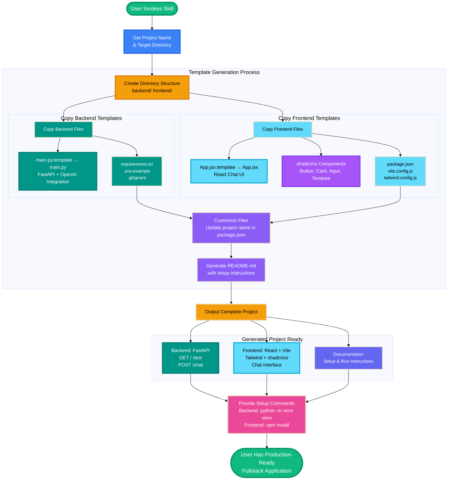

# Fullstack Template Generator - High-Level Workflow

## How The Skill Works

## Key Components

- **Backend Templates**: FastAPI with OpenAI ChatGPT integration, CORS, validation
- **Frontend Templates**: React 19 + Vite 7 + Tailwind CSS 3 + shadcn/ui components
- **Smart Generation**: Removes `.template` suffixes, customizes project names
- **Production-Ready**: Includes all configs, documentation, and setup instructions

## Result

A fully functional fullstack application with:
- ✅ REST API with 3 endpoints (health, test, chat)
- ✅ Modern React UI with chat interface
- ✅ OpenAI integration ready to use
- ✅ All dependencies configured
- ✅ Development and production ready
